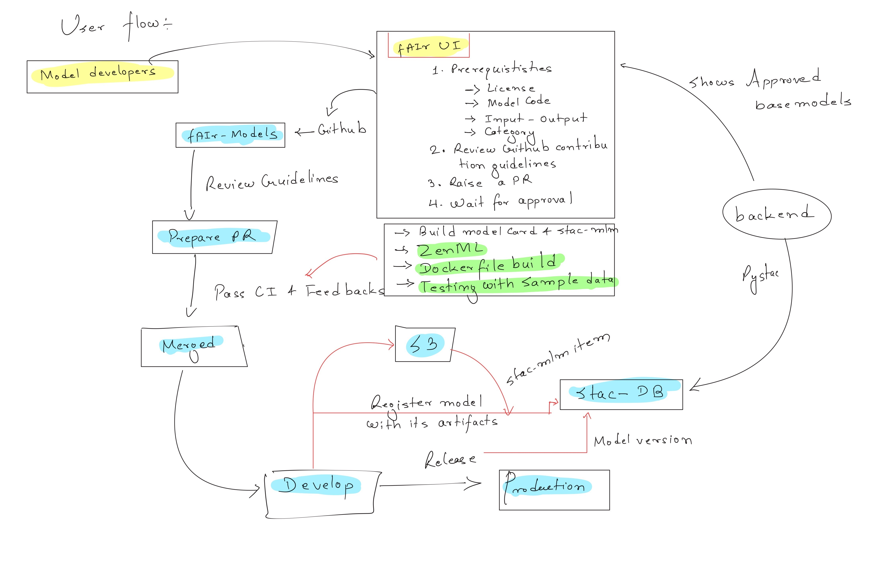

# fAIr-models

Model registry and ML pipeline orchestration for [fAIr](https://github.com/hotosm/fAIr).
Base models are contributed via GitHub PRs. Finetuned models are produced by
ZenML pipelines and published to a STAC catalog on promotion.

## Quickstart

```bash
uv sync --group local --group example
make init
# See examples/building_segmentation/README.md for the full walkthrough
```

## Architecture

### STAC Catalog Structure

Three collections. All items use the [MLM Extension](https://github.com/stac-extensions/mlm)
and [Version Extension](https://github.com/stac-extensions/version).

```
Catalog: fair-models
|
+-- Collection: base-models
|     Model blueprints contributed via PR.
|     Each item = complete model card (weights, code, Docker, MLM spec).
|     Versioned by contributors, registered via CLI utility.
|     |
|     +-- Item: ramp (v1)              category: semantic-segmentation
|     +-- Item: yolo (v1)              category: object-detection
|
+-- Collection: local-models
|     Finetuned models produced by ZenML pipelines.
|     Only promoted (production) versions appear here.
|     |
|     +-- Item: ramp-finetuned-nepal-v2   (production, latest-version)
|     +-- Item: ramp-finetuned-nepal-v1   (deprecated: true)
|     +-- Item: yolo-finetuned-uganda-v1  (production)
|
+-- Collection: datasets
      Training data registered via fAIr UI/backend.
      |
      +-- Item: buildings-kathmandu       category: semantic-segmentation
      +-- Item: trees-utr-in-masuri       category: object-detection
```

### What STAC Items Contain

All fields below are from existing STAC/MLM standards unless noted. We avoid
custom `fair:*` fields wherever a standard exists.

**Base model item** (contributed by model developer):

See [`models/example_unet/stac-item.json`](models/example_unet/stac-item.json) for a complete example.

Key properties: `mlm:name`, `mlm:architecture`, `mlm:tasks`, `mlm:framework`,
`mlm:input` (with `pre_processing_function`), `mlm:output` (with `post_processing_function`
and `classification:classes`), `mlm:hyperparameters`, `keywords`.

Key assets: `model` (weights), `source-code` (with `mlm:entrypoint`),
`training-runtime` / `inference-runtime` (Docker image or "local").

The `mlm:entrypoint` tells the backend which Python function to call.
`pre_processing_function` / `post_processing_function` are standard MLM
Processing Expression fields. This makes the system model-agnostic.

**Local model item** (published on promotion):

Same MLM fields as base model, plus:

- `derived_from` link (standard STAC rel type) pointing to the base model item
- `derived_from` link pointing to the dataset item used for training
- `mlm:model` asset pointing to S3 finetuned weights (different href, same structure)
- Runtime assets reference the same Docker image as parent base model
- Version Extension: `version`, `deprecated`, `predecessor-version` / `successor-version` / `latest-version` links
- `mlm:hyperparameters` reflects the actual training params used (logged from ZenML)

**Dataset item**:

Label + file extensions. Properties: `label:type`, `label:tasks`, `label:classes`, `keywords`.
Assets: `chips` (image directory), `labels` (GeoJSON).

### Tagging and Classification (standards used)

| Concept | Standard field | Example values |
|---|---|---|
| ML task | `mlm:tasks` | `semantic-segmentation`, `object-detection` |
| Feature type tags | `keywords` (STAC core) | `building`, `road`, `tree` |
| Output geometry | `keywords` (STAC core) | `polygon`, `line`, `point` |
| Output classes | `classification:classes` (Classification ext) | `{name: "building", value: 1}` |
| Dataset label type | `label:type` (Label ext) | `vector`, `raster` |
| Dataset label task | `label:tasks` (Label ext) | `segmentation`, `detection` |
| Pre/post processing | `pre_processing_function` / `post_processing_function` (MLM) | Python entrypoint |

`keywords` is the standard STAC way to tag items for search. Both models and
datasets carry `keywords` so the backend can validate compatibility: a model
with `keywords: ["building", "semantic-segmentation", "polygon"]` is compatible
with a dataset tagged `["building", "semantic-segmentation"]`.

### Compatibility Validation

The backend validates that a base model and dataset are compatible before
triggering finetuning. Validation is based on matching `keywords` and
`mlm:tasks` / `label:tasks` between the model and dataset STAC items.

A JSON schema in this repo defines the allowed keyword vocabulary and valid
combinations. If a user picks `ramp` (keywords: `building`,
`semantic-segmentation`) with a dataset tagged `road`, `object-detection`,
the request fails schema validation.

---

## Flows

### 1. Base Model Registration (PR workflow)

```
Model Developer
  |
  | 1. Reads prerequisites on fAIr UI (license, code, I/O spec, category)
  | 2. Reviews contribution guidelines on GitHub
  | 3. Prepares PR to fAIr-Models repo:
  |      models/ramp/
  |        pipeline.py          ZenML steps (train, inference, preprocess)
  |        Dockerfile
  |        stac-item.json       MLM item template
  |        tests/
  v
fAIr-Models (GitHub)
  |
  | CI: build Docker image, validate STAC MLM schema, run tests with sample data
  | Review, feedback, merge
  v
Post-merge (CLI utility / CI action)
  |
  +-- Build + push Docker image to registry (ghcr.io)
  +-- Upload model weights to S3
  +-- Register STAC MLM item in base-models collection
  |     (via STAC API or local JSON)
  v
STAC: base-models/ramp (v1) is now discoverable
```

Version bumps follow the same flow: contributor updates files, PR, merge,
utility publishes new version. Previous version gets `deprecated: true` +
Version Extension links.

### 2. Finetuning (ZenML pipeline)

```
User (fAIr UI)
  |
  | Picks: base model (STAC ID) + dataset (STAC ID)
  | Provides: model name/slug, title, description, training config overrides
  v
fAIr Backend
  |
  | 1. Read base model STAC item --> knows:
  |      - mlm:source_code asset + mlm:entrypoint (which Python function)
  |      - training-runtime asset (which Docker image)
  |      - mlm:input.pre_processing_function (preprocessing entrypoint)
  |      - mlm:output.post_processing_function (postprocessing entrypoint)
  |      - mlm:hyperparameters (default training params)
  |
  | 2. Read dataset STAC item --> knows:
  |      - chips asset href, labels asset href
  |      - label:type, label:tasks, keywords
  |
  | 3. Validate compatibility (keywords + tasks match)
  | 4. Generate ZenML YAML config:
  |      - Merge default mlm:hyperparameters with user overrides
  |      - Set dataset paths, model weights path, Docker image
  |      - Log this YAML as artifact (reproducibility)
  | 5. Trigger: zenml pipeline run --config generated.yaml
  |    (runs in base model's Docker container)
  v
ZenML Pipeline (runs in base model's Docker)
  |
  +-- load_data         reads chips + labels from dataset STAC asset hrefs
  +-- preprocess_data   calls pre_processing_function from MLM metadata
  +-- train_model       finetune from base model weights
  |     +-- log_metadata({mlm fields, metrics, yaml used}, infer_model=True)
  +-- evaluate_model
  |     +-- log_metadata({accuracy, f1, iou, ...}, infer_model=True)
  v
ZenML MCP (Model Control Plane) Database
  |
  | Model: ramp-finetuned-nepal
  |   v1 (stage: None) -- first run
  |   v2 (stage: None) -- second run, different hyperparams
  |   v3 (stage: None) -- third run
  |   ...
  | All runs tracked. YAML config logged per run for reproducibility. 
```

### 3. Promotion --> STAC Publish

```
User (fAIr UI)
  |
  | Picks best version (e.g. v3), clicks "Promote ( Publish )"
  v
fAIr Backend
  |
  | 1. zenml model version update ramp-finetuned-nepal 3 --stage production
  |      ZenML: v3 -> production, previous production (v1) -> archived
  |
  | 2. Publish to STAC (via StacCatalogManager):
  |      - Read v3 metadata from ZenML MCP (mlm fields, metrics, artifact paths)
  |      - Build STAC MLM item for ramp-finetuned-nepal-v3
  |      - Mark previous STAC item (v1) as deprecated: true
  |      - Add Version Extension links (predecessor/successor/latest-version)
  |      - Insert into local-models collection via STAC API
  v
STAC: local-models
  +-- ramp-finetuned-nepal-v3   (production, latest-version)
  +-- ramp-finetuned-nepal-v1   (deprecated: true, predecessor-version)
```

Archive and delete also propagate:

| ZenML action | STAC effect |
|---|---|
| Promote to production | Create item, deprecate previous |
| Archive version | Set `deprecated: true` on item |
| Delete version | Remove item from collection |
| Delete model | Remove all items + clean up |

### 4. Inference

Works for both base models and local models. The STAC item always has enough
information to run inference: model weights, inference runtime, input/output spec.
For each item format like <https://onnx.ai/> should be exported (for inference) and
linked to assets along with model weights for training.

```
Consumer (fAIr UI / API)
  |
  | Picks model (any STAC item from base-models or local-models)
  | Provides input imagery
  v
fAIr Backend
  |
  | 1. Read STAC item --> inference-runtime asset, mlm:model weights, input spec
  | 2. Trigger ZenML inference pipeline in model's Docker container
  v
ZenML Inference Pipeline
  |
  +-- load model weights from STAC mlm:model asset href
  +-- preprocess input via mlm:input.pre_processing_function
  +-- run inference
  +-- postprocess output via mlm:output.post_processing_function
  v
Result returned to consumer
```



### 5. YAML-Driven Pipeline Execution

The backend generates a ZenML YAML config from STAC metadata + user overrides.
Because ZenML doesn't support STAC out of the box we need a bridge in between.
In this way on future if ZenML would be upgarded with something else would be easier.
This YAML is the single artifact that drives both training and inference.
It is logged with each run for full reproducibility.

```
STAC item (mlm:hyperparameters, asset hrefs, entrypoints)
  + user overrides (epochs, lr, batch_size, ...)
  + dataset STAC item (chips href, labels href)
  = generated YAML config
    --> zenml pipeline run --config generated.yaml
```

The pipeline code itself reads this config. No hardcoded paths or params.
Re-running any past experiment = re-running its logged YAML.

---

## Identity Model

| Concept | Example | ZenML representation | STAC representation |
|---|---|---|---|
| Base model | `ramp` | Not in ZenML MCP | Item in `base-models` |
| Finetuned model | `ramp-finetuned-nepal` | ZenML Model (many versions, many runs) | Item(s) in `local-models` (only promoted versions) |
| Specific version | `ramp-finetuned-nepal` v3 | ZenML Model Version 3 | Item `ramp-finetuned-nepal-v3` |
| Dataset | `buildings-kathmandu` | Not in ZenML MCP | Item in `datasets` |

One finetuned model = one ZenML Model in MCP. Each training run = one ZenML Model Version.
A user might run 10 experiments, promote 3 of them over time. Only those 3 appear in STAC.

---

## Infrastructure

| Component | Role | Local | Production |
|---|---|---|---|
| **STAC Catalog** | Public model/dataset registry | pystac JSON catalog | stac-fastapi + pgstac (PostgreSQL + S3) |
| **ZenML** | Pipeline orchestration, version tracking | SQLite (`~/.config/zenml/`) | ZenML Server (PostgreSQL) |
| **Orchestrator** | Runs pipeline steps | `local` | Kubernetes |
| **Artifact Store** | Weights, datasets, artifacts | local filesystem | S3 |
| **Experiment Tracker** | Metrics logging | W&B | W&B |
| **Container Registry** | Model runtime images | local Docker | ghcr.io |
| **fAIr Backend** | User-facing orchestration layer | -- | -- |

ZenML stack components NOT used:

- **Model Registry** -- dropped; STAC catalog (via `StacCatalogManager`) is the publish target, not a ZenML stack component
- **Model Deployer** -- deployment is handled by the fAIr backend, not ZenML
- **Step Operator** -- all steps run in the same environment (the model's Docker image)
- **Image Builder** -- Docker images are built in CI, not by ZenML
- **Data Validator** -- validation is done by the backend before pipeline trigger (keyword + task matching)
- **Alerter** -- notifications handled by the fAIr backend
- **Annotator** -- labeling is external to this system (mainly OSM)
- **Feature Store** -- not applicable; raw chips + labels are the training data

---

## References

### STAC Extensions

- [STAC MLM Extension (v1.5.1)](https://github.com/stac-extensions/mlm) -- ML model metadata, I/O spec, assets, processing expressions.
- [MLM Best Practices](https://github.com/stac-extensions/mlm/blob/main/best-practices.md) -- Recommended companion extensions, framework-specific artifact types.
- [MLM JSON Schema](https://stac-extensions.github.io/mlm/v1.5.1/schema.json)
- [STAC Version Extension (v1.2.0)](https://github.com/stac-extensions/version) -- Version fields and relation types for promotion history.
- [STAC Classification Extension](https://github.com/stac-extensions/classification) -- Output class definitions for model predictions.
- [STAC Label Extension](https://github.com/stac-extensions/label) -- Label type, tasks, classes for dataset items.
- [STAC File Extension](https://github.com/stac-extensions/file) -- Checksum and size for asset integrity.
- [STAC Versioning Best Practices](https://github.com/radiantearth/stac-spec/blob/master/best-practices.md#versioning-for-catalogs) -- Guidance on version history in catalogs.

### ZenML

- [ZenML Model Control Plane](https://docs.zenml.io/concepts/models) -- Model versioning, metadata, artifacts, stage promotion.
- [ZenML Stacks](https://docs.zenml.io/stacks) -- Stack component types and configuration.
- [ZenML Deployment](https://docs.zenml.io/getting-started/deploying-zenml) -- Server deployment (SQLite local, PostgreSQL production).

### fAIr Ecosystem

- [fAIr](https://github.com/hotosm/fAIr) -- Main fAIr application.
- [fAIr-utilities](https://github.com/hotosm/fAIr-utilities) -- Utilities for data preparation and model training.
- [fAIr-utilities sample dataset](https://github.com/hotosm/fAIr-utilities/tree/master/ramp-data/sample_2) -- Current dataset structure: `input/` folder with 256x256 PNG chips (OAM tile naming `OAM-{x}-{y}-{z}.png`) + `labels.geojson`; `prediction/input/` for inference images.
- [fAIr-predictor](https://github.com/hotosm/fairpredictor) -- Standalone predictor ( That will on future query the stac load .oonx and run prediction alone )

### Architecture Decisions

1. **STAC replaces ZenML Model Registry**: STAC is a downstream publish target, not a ZenML stack component. A standalone `StacCatalogManager` (plain Python class) handles `publish_item`, `deprecate_item`, `delete_item`, `list_items`. The backend calls these explicitly on promotion/archive/delete -- no automatic sync.

2. **STAC item = self-sufficient source of truth**: A single STAC item contains everything needed to run training or inference: pipeline entrypoint, Docker image, weights, input/output spec, hyperparameters. Add a new base model item and the system can train/infer with it without code changes.

3. **Finetuned models share parent pipeline code**: Local model STAC items reference the same `mlm:source_code`, Docker image, and pre/post processing functions as their parent base model. Only weights differ.

4. **Standards over custom fields**: `mlm:tasks`, `keywords`, `classification:classes`, `label:type`/`label:tasks`, `pre_processing_function`/`post_processing_function` instead of custom `fair:*` fields until absolutely necessary. Backend validates model-dataset compatibility by matching these standard fields.

5. **YAML-based training & inference**: Every pipeline run is driven by a generated YAML config (STAC defaults + user overrides). Logged as a ZenML artifact. Re-run any experiment by re-running its YAML.

6. **MLM Processing Expression for dispatch**: `pre_processing_function` and `post_processing_function` use `format: "python"` with entrypoint strings (e.g., `ramp.pipeline:preprocess`). Each model defines its own pre/post processing; the system does not assume a fixed pipeline shape. System considers each model having its own runtime , preprocessing , postprocessing and training pipeline.
