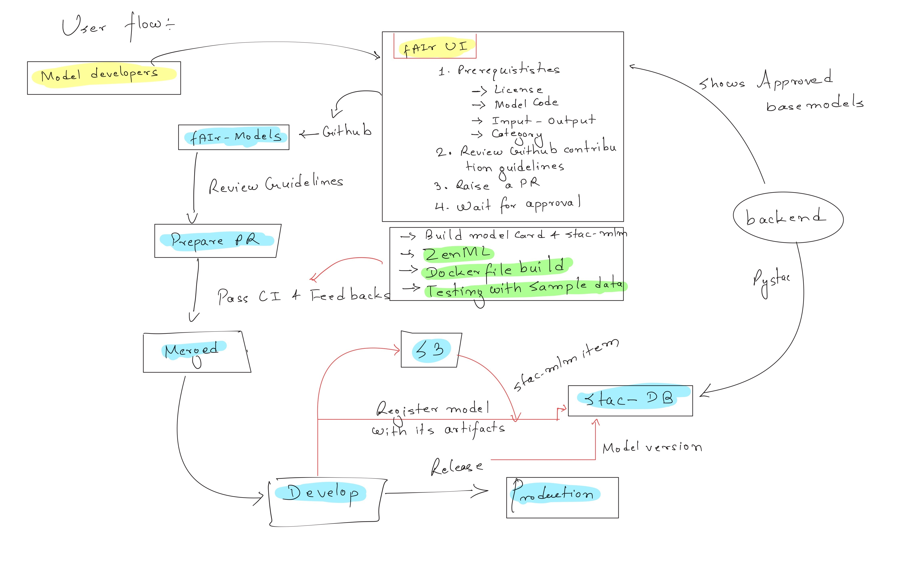
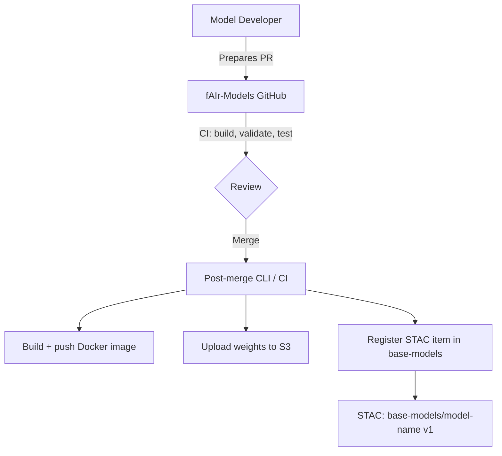
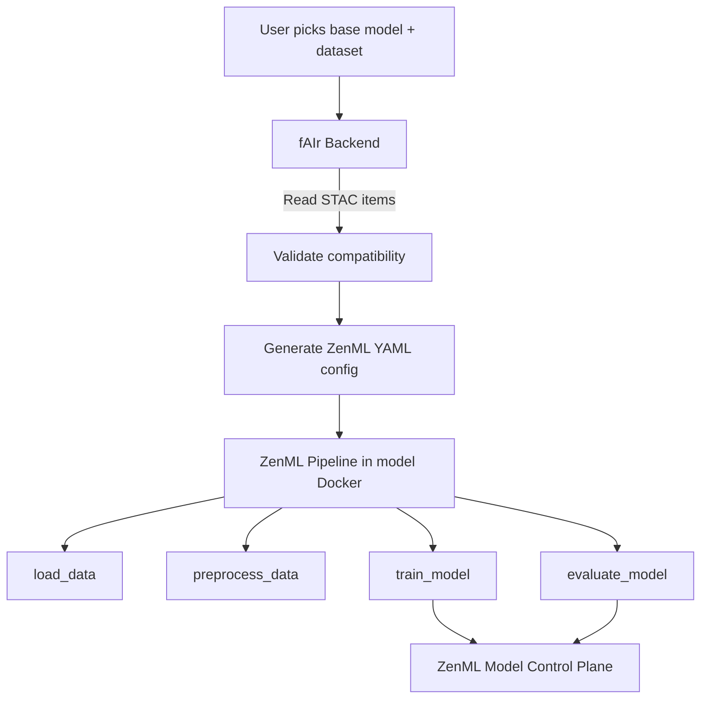
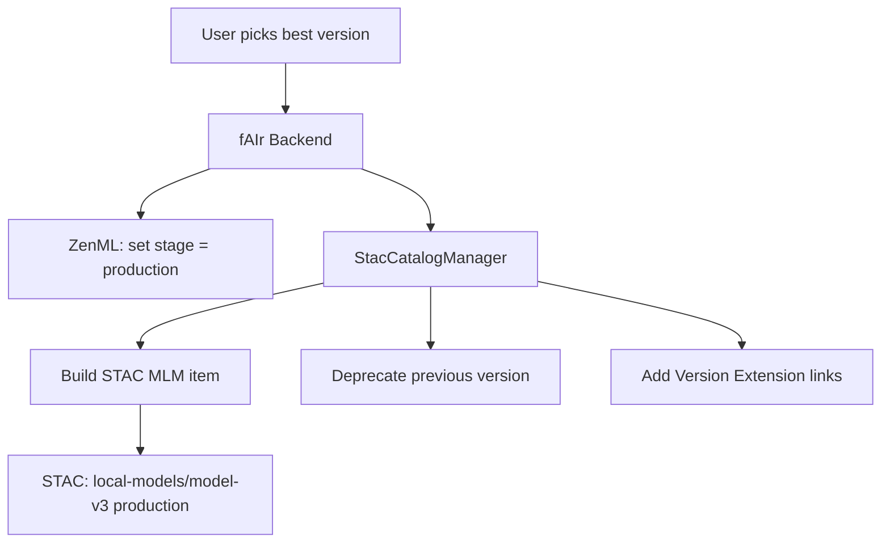

# Architecture

## STAC Catalog Structure

!!! info "Three collections, all items use [MLM Extension](https://github.com/stac-extensions/mlm) and [Version Extension](https://github.com/stac-extensions/version)"

```text title="Catalog hierarchy"
Catalog: fair-models
|
+-- Collection: base-models
|     Model blueprints contributed via PR.
|     Each item = complete model card (weights, code, Docker, MLM spec).
|     Versioned by contributors, registered via CLI utility.
|     |
|     +-- Item: ramp (v1)              category: semantic-segmentation
|     +-- Item: yolo (v1)              category: object-detection
|
+-- Collection: local-models
|     Finetuned models produced by ZenML pipelines.
|     Only promoted (production) versions appear here.
|     |
|     +-- Item: ramp-finetuned-nepal-v2   (production, latest-version)
|     +-- Item: ramp-finetuned-nepal-v1   (deprecated: true)
|     +-- Item: yolo-finetuned-uganda-v1  (production)
|
+-- Collection: datasets
      Training data registered via fAIr UI/backend.
      |
      +-- Item: buildings-kathmandu       category: semantic-segmentation
      +-- Item: trees-utr-in-masuri       category: object-detection
```

??? note "What STAC Items Contain"

    All fields are from existing STAC/MLM standards. Custom `fair:*` fields are
    avoided wherever a standard exists.

    ### Base model item

    See [`models/example_unet/stac-item.json`](https://github.com/hotosm/fAIr-models/blob/master/models/example_unet/stac-item.json) for a complete example.

    Key properties: `mlm:name`, `mlm:architecture`, `mlm:tasks`, `mlm:framework`,
    `mlm:input` (with `pre_processing_function`), `mlm:output` (with `post_processing_function`
    and `classification:classes`), `mlm:hyperparameters`, `keywords`.

    Key assets: `model` (weights), `source-code` (with `mlm:entrypoint`),
    `training-runtime` / `inference-runtime` (Docker image or "local").

    The `mlm:entrypoint` tells the backend which Python function to call.
    `pre_processing_function` / `post_processing_function` are standard MLM
    Processing Expression fields.

    ### Local model item

    Same MLM fields as base model, plus:

    - `derived_from` link pointing to the base model item
    - `derived_from` link pointing to the dataset item used for training
    - `mlm:model` asset pointing to S3 finetuned weights
    - Runtime assets reference the same Docker image as parent base model
    - Version Extension: `version`, `deprecated`, `predecessor-version` / `successor-version` / `latest-version` links
    - `mlm:hyperparameters` reflects the actual training params used

    ### Dataset item

    Label + file extensions. Properties: `label:type`, `label:tasks`, `label:classes`, `keywords`.
    Assets: `chips` (image directory), `labels` (GeoJSON).

## Tagging and Classification

| Concept | Standard field | Example values |
|---|---|---|
| ML task | `mlm:tasks` | `semantic-segmentation`, `object-detection` |
| Feature type tags | `keywords` (STAC core) | `building`, `road`, `tree` |
| Output geometry | `keywords` (STAC core) | `polygon`, `line`, `point` |
| Output classes | `classification:classes` | `{name: "building", value: 1}` |
| Dataset label type | `label:type` (Label ext) | `vector`, `raster` |
| Dataset label task | `label:tasks` (Label ext) | `segmentation`, `detection` |
| Pre/post processing | `pre_processing_function` / `post_processing_function` (MLM) | Python entrypoint |

## Compatibility Validation

!!! warning

    The backend validates that a base model and dataset are compatible before
    triggering finetuning. Validation is based on matching `keywords` and
    `mlm:tasks` / `label:tasks` between the model and dataset STAC items.

## Flows



### 1. Base Model Registration (PR workflow)



### 2. Finetuning (ZenML pipeline)



### 3. Promotion to STAC



| ZenML action | STAC effect |
|---|---|
| Promote to production | Create item, deprecate previous |
| Archive version | Set `deprecated: true` on item |
| Delete version | Remove item from collection |
| Delete model | Remove all items + clean up |

### 4. Inference

Works for both base models and local models. The STAC item always has enough
information to run inference: model weights, inference runtime, input/output spec.

## Identity Model

| Concept | Example | ZenML | STAC |
|---|---|---|---|
| Base model | `ramp` | Not in ZenML MCP | Item in `base-models` |
| Finetuned model | `ramp-finetuned-nepal` | ZenML Model (many versions) | Item(s) in `local-models` |
| Specific version | `ramp-finetuned-nepal` v3 | ZenML Model Version 3 | Item `ramp-finetuned-nepal-v3` |
| Dataset | `buildings-kathmandu` | Not in ZenML MCP | Item in `datasets` |

## Infrastructure

| Component | Local | Production |
|---|---|---|
| **STAC Catalog** | pystac JSON catalog | stac-fastapi + pgstac |
| **ZenML** | SQLite | ZenML Server (PostgreSQL) |
| **Orchestrator** | `local` | Kubernetes |
| **Artifact Store** | local filesystem | S3 |
| **Experiment Tracker** | MLflow | MLflow |
| **Container Registry** | local Docker | ghcr.io |

??? abstract "Architecture Decisions"

    1. **STAC replaces ZenML Model Registry** : STAC is a downstream publish target via `StacCatalogManager`, not a ZenML stack component.
    2. **STAC item = self-sufficient source of truth** : contains everything needed to run training or inference.
    3. **Finetuned models share parent pipeline code** : only weights differ between base and local models.
    4. **Standards over custom fields** : `mlm:tasks`, `keywords`, `classification:classes` instead of custom `fair:*` fields.
    5. **YAML-based training & inference** : every run is driven by a generated config logged as a ZenML artifact.
    6. **MLM Processing Expression for dispatch** : `pre_processing_function` / `post_processing_function` use Python entrypoints.
    7. **Pipeline contract** : every model must export `training_pipeline` and `inference_pipeline` as `@pipeline`-decorated functions.

## References

### STAC Extensions

- [STAC MLM Extension v1.5.1](https://github.com/stac-extensions/mlm)
- [MLM Best Practices](https://github.com/stac-extensions/mlm/blob/main/best-practices.md)
- [STAC Version Extension v1.2.0](https://github.com/stac-extensions/version)
- [STAC Classification Extension](https://github.com/stac-extensions/classification)
- [STAC Label Extension](https://github.com/stac-extensions/label)

### ZenML

- [ZenML Model Control Plane](https://docs.zenml.io/concepts/models)
- [ZenML Stacks](https://docs.zenml.io/stacks)

### fAIr Ecosystem

- [fAIr](https://github.com/hotosm/fAIr)
- [fAIr-utilities](https://github.com/hotosm/fAIr-utilities)
- [fAIr-predictor](https://github.com/hotosm/fairpredictor)
