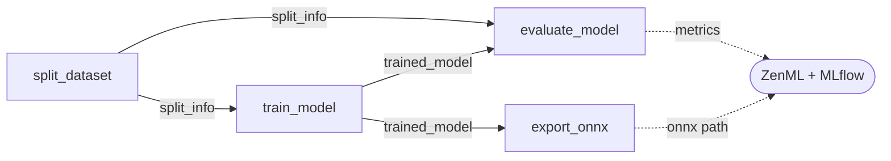
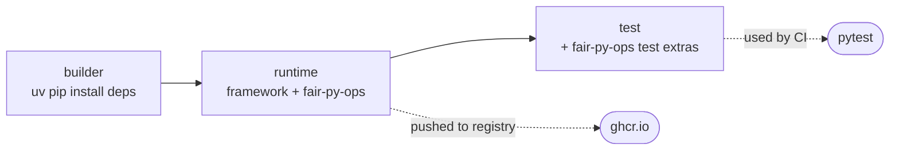
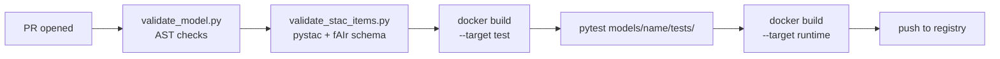

# Contributing a Model

Guide for contributing a base model to fAIr. A base model is a reusable ML
blueprint that users can finetune on their own datasets through the fAIr
platform.

## Reference Implementations

| Model | Task | Architecture | Directory |
|---|---|---|---|
| UNet segmentation | Semantic segmentation | UNet (torchgeo) | [`models/unet_segmentation/`](https://github.com/hotosm/fAIr-models/tree/master/models/unet_segmentation) |
| ResNet18 classification | Binary classification | ResNet18 (torchvision) | [`models/resnet18_classification/`](https://github.com/hotosm/fAIr-models/tree/master/models/resnet18_classification) |
| YOLOv11n detection | Object detection | YOLOv11 nano (ultralytics) | [`models/yolo11n_detection/`](https://github.com/hotosm/fAIr-models/tree/master/models/yolo11n_detection) |

## Model Scope

fAIr targets feature extraction from **very high resolution (VHR) aerial and
satellite imagery** ; typically ~ > 30 cm ground sample distance (GSD), RGB only.
All imagery is sourced from [OpenAerialMap](https://openaerialmap.org/).

### Supported Tasks

| Task | STAC value | Label mapping | Typical output |
| --- | --- | --- | --- |
| Semantic segmentation | `semantic-segmentation` | `segmentation` | polygons |
| Instance segmentation | `instance-segmentation` | `segmentation` | polygons |
| Object detection | `object-detection` | `detection` | boxes or polygons |
| Classification | `classification` | `classification` | existing geometries with attributes |

Your `mlm:tasks` must use one or more of these exact values. CI rejects
anything else.

### Supported Feature Categories

fAIr is a humanitarian mapping platform. Models should prioritise features
that support disaster response, infrastructure mapping, and environmental
monitoring. Core categories:

| Keyword | Examples |
| --- | --- |
| `building` | Residential, commercial, industrial footprints; damaged vs. undamaged assessment |
| `road` | Highway classification (primary, secondary, tertiary); paved vs. unpaved surface detection |
| `tree` | Individual canopy, tree cover areas |
| `water` | Rivers, lakes, ponds, reservoirs |

Other OpenStreetMap feature categories (`landuse`, `bridge`, etc.) are
welcome as long as they are compatible with the platform's RGB input and
vector output constraints. To add a new keyword, include it in
[`keywords.json`](https://github.com/hotosm/fAIr-models/blob/master/fair/schemas/keywords.json) as part of your PR.

### Input Requirements

!!! danger "RGB only"

    All models receive **3-band RGB GeoTIFF chips** as input. The platform does
    **not** accept non-RGB inputs (e.g. multispectral, SAR, DEM).

| Field | Value |
| --- | --- |
| Bands | `red`, `green`, `blue` (3 channels, RGB) |
| Shape | `[-1, 3, H, W]` where H and W are the chip size |
| Dimension order | `["batch", "bands", "height", "width"]` |

Models must normalize the uint8 pixel values (0-255) in
their `preprocess` function.

### Output Requirements

fAIr only supports **vector output**. Your model's final output must produce
GeoJSON geometries of one of these types:

| Geometry type | Keyword | Typical task |
| --- | --- | --- |
| `Polygon` | `polygon` | Building footprints, land parcels |
| `LineString` | `line` | Roads, waterways |
| `Point` | `point` | Tree detection, POI extraction |

Your `stac-item.json` must declare exactly which geometry type the model
produces via the `keywords` array. CI enforces that at least one of `polygon`,
`line`, or `point` is present.

Raster-only output (e.g. raw segmentation masks without vectorization) is
acceptable as an intermediate step, but the `post_processing_function` must
ultimately convert to one of the supported geometry types for downstream
consumption.

### Sample Data Layout

```text title="data/sample/"
data/sample/
  train/
    oam/             # RGB GeoTIFF chips (OAM-{x}-{y}-{z}.tif, ≥30cm GSD)
    osm/             # GeoJSON labels (osm_features_*.geojson)
  predict/
    oam/             # Input chips for inference
    predictions/     # Output directory (model writes here)
```

Chip filenames follow the pattern `OAM-{x}-{y}-{z}.tif` where x, y, z are
tile coordinates. Your model must accept these as input during both training
and inference.

## Prerequisites

Before starting, ensure you have:

- A working ML model for geospatial feature extraction (buildings, roads, trees, etc.)
- Pretrained weights that are publicly downloadable or distributable
- Familiarity with Docker and Python packaging

## License

!!! danger "Required: Open-source license"

    Your model **must** use one of these open-source licenses:

    | License | SPDX identifier |
    | --- | --- |
    | GNU AGPL v3 | `AGPL-3.0-only` |
    | MIT | `MIT` |
    | Apache 2.0 | `Apache-2.0` |
    | BSD 3-Clause | `BSD-3-Clause` |

    The license is declared in your `stac-item.json` under `properties.license`.
    CI rejects any other license value.

## Directory Structure

Create a subdirectory under `models/` named after your model (lowercase,
underscores for spaces, must be a valid Python package name):

```text title="Model directory structure"
models/your_model/
  pipeline.py          # ZenML pipeline with training + inference
  Dockerfile           # Self-contained runtime environment
  stac-item.json       # STAC MLM item (model metadata)
  README.md            # Model overview, limitations, citation
  tests/
    conftest.py        # generate_toy_dataset fixture
    test_steps.py      # Step-level tests
```

## pipeline.py

This is the core of your contribution. It must export two `@pipeline`-decorated
functions that the platform discovers and dispatches automatically.

### Required Exports

CI AST-parses `pipeline.py` and expects the names below. The signatures
are the contract ; use these exact argument names.

| Export | Kind | Wired to |
| --- | --- | --- |
| `training_pipeline` | `@pipeline` | Platform finetuning dispatch |
| `inference_pipeline` | `@pipeline` | Platform inference dispatch |
| `split_dataset` | `@step` | CI AST check |
| `preprocess` | function | `mlm:input[].pre_processing_function` |
| `postprocess` | function | `mlm:output[].post_processing_function` |
| `resolve_weights` | function | `model` asset `href` (when not a URL) |

```python title="pipeline.py contract"
from typing import Annotated, Any
from pathlib import Path
from zenml import pipeline, step

@pipeline
def training_pipeline(
    base_model_weights: str,
    dataset_chips: str,
    dataset_labels: str,
    num_classes: int,
    hyperparameters: dict[str, Any],
) -> None: ...

@pipeline
def inference_pipeline(
    model_uri: str,
    input_images: str,
    chip_size: int,
    num_classes: int,
    zenml_artifact_version_id: str = "",
    use_base_model: bool = False,
) -> None: ...

@step
def split_dataset(
    dataset_chips: str,
    dataset_labels: str,
    hyperparameters: dict[str, Any],
) -> Annotated[dict[str, Any], "split_info"]: ...

def preprocess(image_path: Any, chip_size: int) -> Any: ...
def postprocess(raw_output: Any) -> Any: ...
def resolve_weights(weight_id: str) -> Path: ...
```

### Training flow



| Step | Purpose |
| --- | --- |
| `split_dataset` | Split data, log metadata, return `split_info` |
| `train_model` | Train on **train split only** |
| `evaluate_model` | Evaluate on **val split only**, log metrics |
| `export_onnx` | Export ONNX, validate with `onnx.checker.check_model()` |

The `split_info` dict returned by `split_dataset` is passed as a dependency
to both `train_model` and `evaluate_model`. This enforces step ordering
and guarantees both steps reconstruct the same split.

!!! warning "Train on train, evaluate on val"

    Evaluating on training data produces inflated metrics that do not
    reflect real-world performance. Always use `split_info` to reconstruct
    the same split deterministically in both steps.

!!! tip "Instrumentation"

    Wrap `train_model` with `fair.zenml.instrumentation.mlflow_training_context`
    to auto-log params and metrics to MLflow, and use `zenml.log_metadata()`
    to attach metadata to the ZenML model version.

!!! example "Assembling training_pipeline"

    ```python
    @pipeline
    def training_pipeline(
        base_model_weights: str,
        dataset_chips: str,
        dataset_labels: str,
        num_classes: int,
        hyperparameters: dict[str, Any],
    ) -> None:
        split_info = split_dataset(dataset_chips, dataset_labels, hyperparameters)
        trained = train_model(
            dataset_chips, dataset_labels, base_model_weights,
            hyperparameters, split_info, num_classes,
        )
        evaluate_model(trained, dataset_chips, dataset_labels, hyperparameters, split_info)
        export_onnx(trained_model=trained, hyperparameters=hyperparameters)
    ```

#### split_dataset

Single source of truth for how data is divided into train/val. Read
`val_ratio` and `split_seed` from `hyperparameters`, run your splitting
strategy, log metadata, and return a `split_info` dict for downstream
steps. CI enforces its presence via AST parsing.

```python
@step
def split_dataset(
    dataset_chips: str,
    dataset_labels: str,
    hyperparameters: dict[str, Any],
) -> Annotated[dict[str, Any], "split_info"]:
    val_ratio = hyperparameters.get("val_ratio", 0.2)
    seed = hyperparameters.get("split_seed", 42)

    train, val = my_split_logic(dataset_chips, dataset_labels, val_ratio, seed)

    split_info = {
        "strategy": "random",
        "val_ratio": val_ratio,
        "seed": seed,
        "train_count": len(train),
        "val_count": len(val),
        "description": "...",
    }
    log_metadata(metadata={"fair/split": split_info})
    return split_info
```

The `split_info` dict must contain:

| Key | Type | Description |
| --- | --- | --- |
| `strategy` | string | `"random"`, `"spatial"`, or custom |
| `val_ratio` | float | Actual validation ratio used |
| `seed` | int | Random seed for reproducibility |
| `train_count` | int | Number of training samples |
| `val_count` | int | Number of validation samples |
| `description` | string | Human-readable explanation |

The metadata flows through the promotion pipeline into the local model
STAC item as `fair:split`, giving users full visibility into how each
finetuned model was trained.

#### train_model

Build (or load) your model from `base_model_weights`, loop over the
**train split only** (reconstructed from `split_info`), and return the
trained model. Wrap the loop in `mlflow_training_context` so params and
per-epoch metrics land in MLflow automatically.

```python
@step
def train_model(
    dataset_chips: str,
    dataset_labels: str,
    base_model_weights: str,
    hyperparameters: dict[str, Any],
    split_info: dict[str, Any],
    num_classes: int,
) -> Annotated[Any, "trained_model"]:
    with mlflow_training_context(hyperparameters, ...):
        model = build_model(base_model_weights, num_classes)
        train_loader = build_loader(
            dataset_chips, dataset_labels, split_info, split="train"
        )
        for epoch in range(hyperparameters["epochs"]):
            loss = run_epoch(model, train_loader)
            mlflow.log_metric("train_loss", loss, step=epoch)
    return model.cpu()
```

Must:

- Read only the **train** portion implied by `split_info`
- Apply `freeze_encoder`, `max_grad_norm`, `scheduler`, etc. from `hyperparameters`
- Return an in-memory model (or raw checkpoint bytes for non-picklable
  frameworks ; see the YOLO tip in [Inference flow](#inference-flow))

#### evaluate_model

Reconstruct the **val split** deterministically from `split_info`, run
inference, compute task-appropriate metrics, and publish them so the
platform can copy them onto the promoted local model STAC item.

```python
@step
def evaluate_model(
    trained_model: Any,
    dataset_chips: str,
    dataset_labels: str,
    hyperparameters: dict[str, Any],
    split_info: dict[str, Any],
) -> Annotated[dict[str, Any], "metrics"]:
    val_loader = build_loader(
        dataset_chips, dataset_labels, split_info, split="val"
    )
    metrics = compute_metrics(trained_model, val_loader)
    log_evaluation_results(metrics)
    return metrics
```

!!! warning "Metric keys must match `fair:metrics_spec`"

    The keys you return here are the keys the platform copies onto the
    promoted STAC item. They must match the entries you declared in
    `fair:metrics_spec`. For per-class IoU, use the names from
    `classification:classes` (e.g. `iou_building`), not numeric indices
    like `iou_class_0`.

#### export_onnx

Export the trained model to ONNX for downstream inference runtimes and
validate the result with `onnx.checker.check_model()`. CI relies on a
valid ONNX file being produced by this step.

```python
@step
def export_onnx(
    trained_model: Any,
    hyperparameters: dict[str, Any],
) -> Annotated[str, "onnx_model"]:
    chip_size = hyperparameters.get("chip_size", 256)
    dummy = torch.randn(1, 3, chip_size, chip_size)
    _, path = tempfile.mkstemp(suffix=".onnx")
    torch.onnx.export(
        trained_model.cpu().eval(),
        (dummy,),
        path,
        input_names=["input"],
        output_names=["output"],
        dynamic_axes={"input": {0: "batch"}, "output": {0: "batch"}},
        opset_version=18,
    )
    onnx.checker.check_model(path)
    return path
```

??? info "Auto-injected training parameters"

    The platform injects these into `training_pipeline` from the STAC
    items. Your signature must accept them, but you do **not** declare
    them in `mlm:hyperparameters`.

    | Parameter | Source |
    |---|---|
    | `model_name` | User input (ZenML model name) |
    | `base_model_id` | Base model STAC item ID |
    | `dataset_id` | Dataset STAC item ID |
    | `num_classes` | `len(classification:classes)` |
    | `class_names` | `classification:classes[].name` |
    | `chip_size` | `mlm:input[0].input.shape[-1]` |
    | `dataset_chips` | Dataset `chips` asset href |
    | `dataset_labels` | Dataset `labels` asset href |

### Inference flow

`inference_pipeline` handles **two branches**. The platform injects
`use_base_model=True` whenever the target STAC item has no ZenML artifact
attached, so every model **must** support both.

| Branch | Condition | How to load weights |
| --- | --- | --- |
| Finetuned | `use_base_model=False` | `fair.zenml.steps.load_model` (materializer handles deserialization) |
| Base model | `use_base_model=True` | Your own `load_base_model` step, which calls `resolve_weights` |

=== "inference_pipeline"

    ```python
    @pipeline
    def inference_pipeline(
        model_uri: str,
        input_images: str,
        chip_size: int,
        num_classes: int,
        zenml_artifact_version_id: str = "",
        use_base_model: bool = False,
    ) -> None:
        if use_base_model:
            model = load_base_model(model_uri, num_classes)
        else:
            model = load_model(model_uri, zenml_artifact_version_id)
        predict(model, input_images, chip_size)
    ```

=== "load_base_model"

    ```python
    @step
    def load_base_model(model_uri: str, num_classes: int) -> Any:
        checkpoint = resolve_weights(model_uri)
        model = build_fresh_architecture(num_classes)
        model.load_state_dict(load_state(checkpoint))
        return model
    ```

!!! tip "Non-serializable frameworks (YOLO pattern)"

    If your framework's model object isn't pickle-safe (e.g. ultralytics
    YOLO), return raw checkpoint **bytes**
    (`Path(checkpoint).read_bytes()`) from `train_model` and
    `load_base_model` instead of the model object. Downstream steps write
    the bytes back to a temp file and reopen with the framework loader
    (e.g. `YOLO(tmp_path)`). See
    [`models/yolo11n_detection/pipeline.py`](https://github.com/hotosm/fAIr-models/tree/master/models/yolo11n_detection/pipeline.py).

### Pre/post processing & weights

Three module-level helpers are referenced from the STAC item by dotted
path. Keep their bodies small ; they should just wrap your existing ML
code.

=== "preprocess"

    Turn a chip path into a model-ready tensor. Referenced from
    `mlm:input[].pre_processing_function`.

    ```python
    def preprocess(image_path: Any, chip_size: int) -> Any:
        # 1. open RGB GeoTIFF
        # 2. normalize uint8 → float32 in [0, 1]
        # 3. resize to (chip_size, chip_size) if needed
        tensor = ...
        return tensor
    ```

=== "postprocess"

    Convert raw model output to decoded predictions (labels / masks /
    boxes). Referenced from `mlm:output[].post_processing_function`.

    ```python
    def postprocess(raw_output: Any) -> Any:
        # threshold / NMS / decode however your task needs
        return predictions
    ```

=== "resolve_weights"

    Resolve a weight identifier (framework enum, short name, URL) to a
    local checkpoint `Path`.

    ```python
    def resolve_weights(weight_id: str) -> Path:
        # look up framework weight enum, or download from URL/S3
        return checkpoint_path
    ```

    **Required** when the `model` asset `href` is not a direct URL (e.g.
    `torchvision.models.ResNet18_Weights.IMAGENET1K_V1` or `yolo11n.pt`).
    CI enforces its presence via AST parsing.

    When `upload_artifacts=True`, the platform calls `resolve_weights`,
    uploads the result to S3, and rewrites the STAC `href` to the S3 URL.

!!! info "Data resolution"

    Training data lives in S3 (prod) or the local filesystem (dev). Use
    `fair.utils.data.resolve_directory` and `fair.utils.data.resolve_path`
    ; both return local `Path` objects transparently. **Never hardcode
    paths. Never bake data into Docker images.**

## Dockerfile

Your Dockerfile must be **self-contained** and use **three named stages**:



| Stage | Purpose |
|---|---|
| `builder` | Install and compile all dependencies |
| `runtime` | Production image (ML framework + fair-py-ops, no test deps) |
| `test` | Extends `runtime` with `fair-py-ops[test]` (pytest + zenml[server]) for CI |

Requirements:

1. Use `uv pip install` in the builder (not bare `pip`)
2. Install `/tmp/fair-src[k8s]` from the copied project source
3. The `test` stage must install `/tmp/fair-src[test]` via `uv pip install --system`
4. Set `ENTRYPOINT ["/usr/local/bin/python"]`
5. Never install test dependencies in the `runtime` stage

CI builds `--target test` to run tests, then pushes only `--target runtime`.

See any existing model Dockerfile (e.g. `models/unet_segmentation/Dockerfile`)
for the full pattern.

## Testing

Each model needs a `tests/` directory with two files:

- `conftest.py` : a `generate_toy_dataset` fixture that creates toy chips + labels at test time
- `test_steps.py` : four test functions : `test_split_dataset`, `test_train_model`, `test_evaluate_model`, `test_export_onnx`

The shared `models/conftest.py` provides common fixtures (`toy_chips`,
`toy_labels`, `base_hyperparameters`, etc.) automatically. You only write
`generate_toy_dataset`.

=== "conftest.py"

    ```python title="tests/conftest.py (skeletal)"
    import pytest

    @pytest.fixture
    def generate_toy_dataset(tmp_path):
        chips_dir = tmp_path / "chips"
        labels_dir = tmp_path / "labels"
        # write a handful of tiny RGB GeoTIFFs + matching GeoJSON labels
        make_toy_chips(chips_dir, count=4)
        make_toy_labels(labels_dir, count=4)
        return {
            "chips": str(chips_dir),
            "labels": str(labels_dir),
            "dataset_stac_item": build_toy_dataset_item(chips_dir, labels_dir),
        }
    ```

=== "test_steps.py"

    ```python title="tests/test_steps.py (skeletal)"
    from models.your_model.pipeline import (
        split_dataset, train_model, evaluate_model, export_onnx,
    )

    def test_split_dataset(generate_toy_dataset, base_hyperparameters):
        info = split_dataset.entrypoint(
            generate_toy_dataset["chips"],
            generate_toy_dataset["labels"],
            base_hyperparameters,
        )
        assert info["train_count"] > 0 and info["val_count"] > 0

    def test_train_model(generate_toy_dataset, base_hyperparameters):
        ...  # run train_model.entrypoint on the toy split, assert non-null output

    def test_evaluate_model(...): ...
    def test_export_onnx(...): ...
    ```

See `models/resnet18_classification/tests/`, `models/yolo11n_detection/tests/`,
or `models/unet_segmentation/tests/` for complete working examples.

```bash
just test-models your-model   # Build Docker image + run tests
```

## stac-item.json

The STAC item is your model's metadata card. It follows the
[STAC MLM Extension v1.5.1](https://github.com/stac-extensions/mlm) and is
validated by CI against the platform's requirements schema.

??? note "Required Extensions"

    ```json
    "stac_extensions": [
        "https://stac-extensions.github.io/mlm/v1.5.1/schema.json",
        "https://stac-extensions.github.io/version/v1.2.0/schema.json",
        "https://stac-extensions.github.io/classification/v2.0.0/schema.json",
        "https://stac-extensions.github.io/file/v2.1.0/schema.json",
        "https://stac-extensions.github.io/raster/v1.1.0/schema.json"
    ]
    ```

### Required Properties

| Property | Type | Description |
| --- | --- | --- |
| `title` | string | Human-readable model name (shown in catalog UI) |
| `description` | string | One-paragraph summary of the model and its intended use |
| `mlm:name` | string | Model identifier (matches directory name) |
| `mlm:architecture` | string | Architecture name (e.g. `UNet`, `YOLOv8`) |
| `mlm:tasks` | string[] | One or more of: `semantic-segmentation`, `instance-segmentation`, `object-detection`, `classification` |
| `mlm:framework` | string | `PyTorch` or `TensorFlow` |
| `mlm:framework_version` | string | Framework version |
| `mlm:pretrained` | boolean | Whether pretrained weights are used |
| `mlm:pretrained_source` | string | Origin of the pretrained weights: a URL to the paper/dataset/checkpoint, or a descriptive string when no canonical URL exists |
| `mlm:input` | object[] | Input specification with `pre_processing_function` |
| `mlm:output` | object[] | Output specification with `post_processing_function` and `classification:classes` |
| `mlm:hyperparameters` | object | Default training hyperparameters |
| `keywords` | string[] | Feature tags + task + output geometry type |
| `version` | string | Semantic version (start with `"1"`) |
| `license` | string | SPDX license identifier |
| `fair:metrics_spec` | object[] | Evaluation metrics vocabulary (see below) |
| `fair:split_spec` | object | Train/val split specification (see below) |

### fair:metrics_spec

The MLM extension does not define evaluation metrics semantics. `fair:metrics_spec`
fills this gap by declaring the meaning and storage location of each evaluation
metric your model produces during `evaluate_model`. Users need this to understand
what `"accuracy"` means (pixel accuracy? per-class? mean IoU?).

Each entry must declare:

| Field | Type | Description |
| --- | --- | --- |
| `key` | string | Property key where the metric is stored on the local model STAC item (e.g. `fair:accuracy`) |
| `name` | string | Human-readable metric name |
| `description` | string | Precise definition including averaging strategy |

=== "Segmentation"

    ```json title="fair:metrics_spec (unet_segmentation)"
    "fair:metrics_spec": [
        {"key": "fair:mean_iou", "name": "Mean IoU", "description": "Mean intersection-over-union across all classes, including background."},
        {"key": "iou_building", "name": "Building IoU", "description": "Per-class IoU for the 'building' class (matches classification:classes entry)."},
        {"key": "fair:pixel_accuracy", "name": "Pixel Accuracy", "description": "Fraction of pixels correctly classified across the val split."}
    ]
    ```

=== "Detection"

    ```json title="fair:metrics_spec (yolo11n_detection)"
    "fair:metrics_spec": [
        {"key": "fair:map50", "name": "mAP@0.5", "description": "Mean average precision at IoU threshold 0.5 across all classes."},
        {"key": "fair:map50_95", "name": "mAP@0.5:0.95", "description": "Mean average precision averaged over IoU thresholds 0.5 to 0.95."},
        {"key": "fair:precision", "name": "Precision", "description": "Box-level precision at the default confidence threshold."}
    ]
    ```

=== "Classification"

    ```json title="fair:metrics_spec (resnet18_classification)"
    "fair:metrics_spec": [
        {"key": "fair:accuracy", "name": "Accuracy", "description": "Top-1 accuracy on the val split."},
        {"key": "fair:f1", "name": "F1 Score", "description": "Macro-averaged F1 across all classes."}
    ]
    ```

When `evaluate_model` logs metrics via `log_metadata(infer_model=True)`, the platform
copies those values to the promoted local model STAC item. Class IoU keys use the
`classification:classes` names, e.g. `iou_background`, `iou_building` (not numeric
indices like `iou_class_0`).

### fair:split_spec

The `fair:split_spec` property declares how your model expects training data
to be split into train and validation sets. This is a **required** property
on base model STAC items. CI validates its presence and structure.

| Field | Type | Description |
| --- | --- | --- |
| `strategy` | string | Split strategy: `"random"`, `"spatial"`, or custom |
| `default_ratio` | float | Recommended validation ratio (0 < ratio < 1) |
| `seed` | int | Default random seed for reproducibility |
| `description` | string | Explanation of how the split works for this model |

The split strategy depends on the task type:

| Task | Strategy | Description |
| --- | --- | --- |
| Classification | `random` | Seeded shuffle of sorted filenames, split at ratio boundary |
| Segmentation | `spatial` | `RandomGeoSampler` for train, `GridGeoSampler` for val (non-overlapping tiles) |
| Detection | `random` | Last N% of sorted image IDs held out for validation |

=== "Random"

    ```json title="fair:split_spec (resnet18_classification)"
    "fair:split_spec": {
        "strategy": "random",
        "default_ratio": 0.2,
        "seed": 42,
        "description": "Seeded shuffle of sorted image filenames, first (1 - ratio) for train, remainder for val."
    }
    ```

=== "Spatial"

    ```json title="fair:split_spec (unet_segmentation)"
    "fair:split_spec": {
        "strategy": "spatial",
        "default_ratio": 0.2,
        "seed": 42,
        "description": "RandomGeoSampler over training AOI, GridGeoSampler for non-overlapping val tiles; avoids spatial leakage between splits."
    }
    ```

Contributors can define custom split strategies as long as they document the
approach in `description` and implement the corresponding `split_dataset`
step. The `val_ratio` and `split_seed` hyperparameters allow users to
override the defaults at finetuning time.

### Keywords

The `keywords` array must include:

1. **At least one feature keyword**: `building`, `road`, `tree`, `water`, `landuse`
2. **At least one task keyword**: matches `mlm:tasks` values
3. **Exactly one geometry type**: `polygon`, `line`, or `point`

Example: `["building", "semantic-segmentation", "polygon"]`

### Hyperparameters

The `mlm:hyperparameters` object in your STAC item declares the **default
training configuration**. When users finetune your model, the platform reads
these defaults and merges any user overrides into a generated YAML config
(via `fair.zenml.config.generate_training_config`). This YAML is then passed
to your `training_pipeline`.

Your `training_pipeline` receives all hyperparameters as a single
`hyperparameters: dict[str, Any]` argument. Each step reads values with
`hyperparameters.get("epochs", ...)` and applies defaults locally.
Validation is declared in the STAC item under `fair:hyperparameters_spec`,
**not** in the Python signature.

Each entry in `fair:hyperparameters_spec` declares:

| Field | Description |
| --- | --- |
| `key` | Hyperparameter name, must also appear in `mlm:hyperparameters` |
| `type` | One of `int`, `float`, `str`, `bool` |
| `default` | Default value |
| `min` / `max` | Bounds for numeric types |
| `values` | Allowed values for `str` with a fixed choice set |
| `description` | Short human-readable explanation |

```json title="fair:hyperparameters_spec (excerpt)"
"fair:hyperparameters_spec": [
    {"key": "epochs", "type": "int", "default": 5, "min": 1, "max": 500, "description": "..."},
    {"key": "learning_rate", "type": "float", "default": 0.001, "min": 1e-5, "max": 1.0, "description": "..."},
    {"key": "scheduler", "type": "str", "default": "cosine", "values": ["cosine", "none"], "description": "..."}
]
```

The platform uses this spec to render the finetuning form, validate user
overrides at submission time, and populate the YAML config passed to
`training_pipeline`.

In addition to model-specific hyperparameters, you **must** declare these
split parameters (the others are recommended unless the training framework
manages them internally, e.g. Ultralytics):

| Parameter | Required | Description |
| --- | --- | --- |
| `val_ratio` | Yes | Fraction of data held out for validation (default 0.2) |
| `split_seed` | Yes | Random seed for reproducible train/val split (default 42) |
| `scheduler` | Recommended | LR scheduler: `"cosine"` or `"none"` |
| `max_grad_norm` | Recommended | Maximum gradient norm for clipping |

See the three reference models under `models/` for working
`fair:hyperparameters_spec` and `mlm:hyperparameters` blocks.

The platform auto-extracts `chip_size` from `mlm:input[0].input.shape[-1]`
and `num_classes` from `classification:classes` length, so those don't need
to be duplicated in `mlm:hyperparameters` unless your defaults differ.

Each entry in `mlm:input` must declare exactly 3 RGB bands
(`shape: [-1, 3, H, W]`, `dim_order: [batch, bands, height, width]`,
`data_type: float32`) and a `pre_processing_function` pointing to your
`preprocess` entrypoint (`models.your_model.pipeline:preprocess`).

Each entry in `mlm:output` must declare `result` (shape, dim_order,
data_type), `classification:classes` (one entry per output class with
`name` and `value`), and a `post_processing_function` pointing to your
`postprocess` entrypoint.

=== "Segmentation"

    ```json title="mlm:input / mlm:output (unet_segmentation)"
    "mlm:input": [{
        "name": "rgb",
        "bands": ["red", "green", "blue"],
        "input": {
            "shape": [-1, 3, 256, 256],
            "dim_order": ["batch", "bands", "height", "width"],
            "data_type": "float32"
        },
        "pre_processing_function": "models.unet_segmentation.pipeline:preprocess"
    }],
    "mlm:output": [{
        "name": "mask",
        "tasks": ["semantic-segmentation"],
        "result": {
            "shape": [-1, 2, 256, 256],
            "dim_order": ["batch", "classes", "height", "width"],
            "data_type": "float32"
        },
        "classification:classes": [
            {"name": "background", "value": 0},
            {"name": "building", "value": 1}
        ],
        "post_processing_function": "models.unet_segmentation.pipeline:postprocess"
    }]
    ```

=== "Detection"

    ```json title="mlm:input / mlm:output (yolo11n_detection)"
    "mlm:input": [{
        "name": "rgb",
        "bands": ["red", "green", "blue"],
        "input": {
            "shape": [-1, 3, 640, 640],
            "dim_order": ["batch", "bands", "height", "width"],
            "data_type": "float32"
        },
        "pre_processing_function": "models.yolo11n_detection.pipeline:preprocess"
    }],
    "mlm:output": [{
        "name": "boxes",
        "tasks": ["object-detection"],
        "result": {
            "shape": [-1, 6],
            "dim_order": ["detections", "xyxy_conf_class"],
            "data_type": "float32"
        },
        "classification:classes": [
            {"name": "building", "value": 0}
        ],
        "post_processing_function": "models.yolo11n_detection.pipeline:postprocess"
    }]
    ```

=== "Classification"

    ```json title="mlm:input / mlm:output (resnet18_classification)"
    "mlm:input": [{
        "name": "rgb",
        "bands": ["red", "green", "blue"],
        "input": {
            "shape": [-1, 3, 224, 224],
            "dim_order": ["batch", "bands", "height", "width"],
            "data_type": "float32"
        },
        "pre_processing_function": "models.resnet18_classification.pipeline:preprocess"
    }],
    "mlm:output": [{
        "name": "label",
        "tasks": ["classification"],
        "result": {
            "shape": [-1, 2],
            "dim_order": ["batch", "classes"],
            "data_type": "float32"
        },
        "classification:classes": [
            {"name": "no_building", "value": 0},
            {"name": "building", "value": 1}
        ],
        "post_processing_function": "models.resnet18_classification.pipeline:postprocess"
    }]
    ```

### Required Assets

| Asset key | Purpose | Required fields |
| --- | --- | --- |
| `model` | Pretrained weights | `mlm:artifact_type` (e.g. `torch.save`, `onnx`) |
| `source-code` | Link to model source code (git URL) | `mlm:entrypoint` (e.g. `models.your_model.pipeline:training_pipeline`) |
| `mlm:training` | Training Docker image | `href` = Docker image reference |
| `mlm:inference` | Inference Docker image | `href` = Docker image reference |
| `readme` | Model documentation (README.md) | _(none)_ |

??? example "Concrete assets block"

    ```json title="stac-item.json (assets excerpt)"
    "assets": {
        "model": {
            "href": "torchgeo.models.Unet_Weights.OAM_RGB_RESNET34_TCD",
            "type": "application/octet-stream",
            "title": "UNet pretrained weights",
            "roles": ["mlm:model"],
            "mlm:artifact_type": "torch.save"
        },
        "source-code": {
            "href": "https://github.com/hotosm/fAIr-models/tree/master/models/unet_segmentation/pipeline.py",
            "type": "text/x-python",
            "title": "UNet pipeline source",
            "roles": ["mlm:source_code"],
            "mlm:entrypoint": "models.unet_segmentation.pipeline:training_pipeline"
        },
        "mlm:training": {
            "href": "ghcr.io/hotosm/fair-models/unet_segmentation:latest",
            "type": "application/vnd.oci.image.manifest.v1+json",
            "title": "Training runtime image",
            "roles": ["mlm:training-runtime"]
        },
        "mlm:inference": {
            "href": "ghcr.io/hotosm/fair-models/unet_segmentation:latest",
            "type": "application/vnd.oci.image.manifest.v1+json",
            "title": "Inference runtime image",
            "roles": ["mlm:inference-runtime"]
        },
        "readme": {
            "href": "https://raw.githubusercontent.com/hotosm/fAIr-models/refs/heads/main/models/unet_segmentation/README.md",
            "type": "text/markdown",
            "title": "Model README",
            "roles": ["metadata"]
        }
    }
    ```

Model weights must be downloadable from the `model` asset `href`. This can be
a direct URL, S3 path, or a framework-specific weight enum (e.g.
`torchgeo.models.Unet_Weights.OAM_RGB_RESNET34_TCD`). Your `pipeline.py` is
responsible for resolving and loading the weights at runtime.

!!! info "Weight upload to S3"

    When `upload_artifacts=True`, the platform downloads the pretrained weights
    via your `resolve_weights` function, uploads them to S3, and updates the
    STAC item href to the S3 URL. If your model asset href is already a URL,
    CI validates it is accessible. If it is a framework weight reference,
    CI validates that `resolve_weights` exists in `pipeline.py`.

The `readme` asset `href` must be an **absolute URL** to the raw file
(e.g. `https://raw.githubusercontent.com/hotosm/fAIr-models/refs/heads/main/models/your_model/README.md`).
Relative paths such as `./README.md` are not accessible from deployed STAC
catalogs and will be flagged by validation.

The `source-code` asset `href` must point to the git repository (or tree URL)
where the model's source code lives. This is validated by CI and displayed on
the model's catalog page.

### cite-as Link

If your model or its pretrained weights come from a published paper, add a
`cite-as` link under `links[]` pointing to the canonical DOI (preferred)
or arXiv URL. This link is displayed in the catalog UI.

```json title="stac-item.json (links excerpt)"
"links": [
    {
        "rel": "cite-as",
        "href": "https://doi.org/10.48550/arXiv.1505.04597",
        "title": "U-Net: Convolutional Networks for Biomedical Image Segmentation"
    }
]
```

## README.md

Every model **must** include a `README.md` in its directory. This is the
human-readable documentation for your model ; it covers context that the STAC
MLM item cannot express.

The README is referenced as a `readme` asset in `stac-item.json` with an
**absolute raw GitHub URL** (see [Required Assets](#required-assets) above).
Validation checks that the README file exists locally and that the asset is
present in the STAC item.

### What to include

| Section | Content |
| --- | --- |
| **Overview** | One-paragraph summary: what the model does, target geography, intended use |
| **Architecture** | Model type, backbone, input/output shapes, key design choices |
| **Pretrained source** | Training dataset, paper reference, data license |
| **Limitations** | Known failure modes, geographic bias, resolution constraints |
| **Usage** | How to run training/inference locally, example commands |
| **Citation** | BibTeX or reference if the model or weights come from published work |
| **License** | License name (must match `properties.license` in `stac-item.json`) |

Keep it concise. The STAC item already captures hyperparameters, input/output
specs, and keywords ; the README is for everything else.

!!! warning "Prose only ; no code snippets"

    Do **not** paste `pipeline.py` snippets, training loops, or config
    examples into the README. Code in two places drifts out of sync. The
    reference models and this contributing guide are the source of truth
    for code; the README is for prose: what, why, limitations, citation.

## PR Checklist

Before opening a PR, make sure:

=== "Files"

    - [ ] `models/your_model/` includes `pipeline.py`, `Dockerfile`, `stac-item.json`, and `README.md`
    - [ ] `README.md` explains the model clearly enough for another developer to use it
    - [ ] `README.md` contains prose only (no code snippets)

=== "Pipeline"

    - [ ] `pipeline.py` exports `training_pipeline` and `inference_pipeline` as `@pipeline`
    - [ ] `pipeline.py` exports `split_dataset` as `@step`
    - [ ] `pipeline.py` exports `preprocess`, `postprocess`, and (if weights are not a direct URL) `resolve_weights`
    - [ ] `train_model` reads the **train** split only; `evaluate_model` reads the **val** split only

=== "Docker"

    - [ ] `Dockerfile` has three stages: `builder`, `runtime` (production), and `test` (CI)
    - [ ] `runtime` stage contains no test dependencies
    - [ ] `ENTRYPOINT` is `["/usr/local/bin/python"]`

=== "Tests"

    - [ ] `tests/conftest.py` defines `generate_toy_dataset` fixture returning `{"chips", "labels", "dataset_stac_item"}`
    - [ ] `tests/test_steps.py` defines `test_split_dataset`, `test_train_model`, `test_evaluate_model`, `test_export_onnx`
    - [ ] `just test-models your_model` passes inside Docker

=== "STAC"

    - [ ] `stac-item.json` declares `fair:metrics_spec`, `fair:split_spec`, and `fair:hyperparameters_spec`
    - [ ] `keywords` includes a feature tag, a task value, and exactly one geometry type
    - [ ] `license` is a supported SPDX identifier
    - [ ] `just validate` passes for the model and STAC item

The full requirements are described in the sections above, especially the STAC metadata, pipeline structure, assets, and README guidance. CI checks the detailed metadata, pipeline exports, Docker build, and consistency rules for you.

## CI Checks



On PR submission, CI will:

1. **Validate pipeline exports** : `scripts/validate_model.py` checks for `training_pipeline` and `inference_pipeline` (`@pipeline`), `split_dataset` (`@step`), and required test functions via AST parsing
2. **Validate STAC item** : `scripts/validate_stac_items.py` runs `pystac` validation against the fAIr base model schema (requires `fair:metrics_spec`, `fair:split_spec`, all MLM fields, assets, keywords including a geometry type, and a supported license)
3. **Build test Docker image** : builds `--target test` which includes pytest and zenml[server]
4. **Run step tests** : `python -m pytest models/<name>/tests/` inside the test image validates all 4 pipeline steps with toy data
5. **Push production image** : builds `--target runtime` (no test deps) and pushes to the container registry

All checks must pass before the PR is reviewed.

## Local Development

```bash title="Local dev workflow"
just setup                             # Install deps + ZenML init
just validate                          # Validate STAC items + model pipelines
just test                              # Run tests
just example                           # Run full example pipeline
```

## Reference

- [STAC MLM Extension v1.5.1](https://github.com/stac-extensions/mlm) -- MLM fields spec
- [MLM Best Practices](https://github.com/stac-extensions/mlm/blob/main/best-practices.md)
- [UNet segmentation model](https://github.com/hotosm/fAIr-models/tree/master/models/unet_segmentation) -- segmentation reference
- [ResNet18 classification model](https://github.com/hotosm/fAIr-models/tree/master/models/resnet18_classification) -- classification reference
- [YOLOv11n detection model](https://github.com/hotosm/fAIr-models/tree/master/models/yolo11n_detection) -- detection reference
- [UNet STAC item](https://github.com/hotosm/fAIr-models/blob/master/models/unet_segmentation/stac-item.json) -- STAC item template
